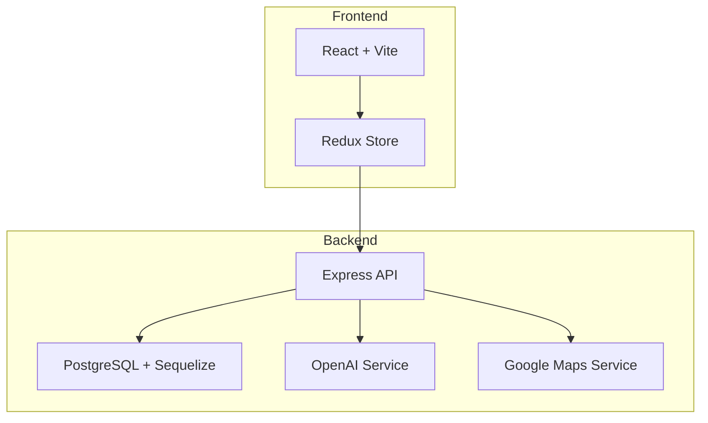

# AMP Report MVP Presentation

---

## Vision

Deliver AI-powered analytics and amenity recommendations that help multifamily property owners maximise revenue and resident satisfaction.

---

## Problem

* Hard to understand true tenant demographics
* Amenities often chosen by intuition not data
* Manual market analysis is time-consuming

---

## Solution – AMP Report

1. Aggregates public & proprietary data
2. Uses OpenAI to build tenant profiles
3. Recommends high-ROI amenities
4. Generates shareable PDF reports

---

## Architecture Overview

---

## MVP Scope

* User authentication
* Property CRUD
* Tenant profile generation
* Amenity recommendation engine
* PDF report export

---

## Demo

(Here you will switch to the live application and walk through creating a property, generating an analysis, and exporting the PDF.)

---

## Next Steps

* Add comparisons against competitor properties
* Cost-benefit calculations for amenities
* Multi-property portfolio dashboard

---

## Thank You!

Questions?
